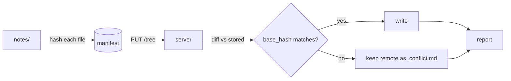

# Push flow

One request per push. The client hashes; the server diffs and decides.



### Client

```ts
export async function push(root: string): Promise<Report> {
  const manifest = await hashTree(root);
  const res = await api.tree.put(manifest);
  if (!res.ok) throw new PushError(res.status, res.body); // server decided, we only report
  return res.body;
}
```

### Server

```rust
/// Picks the outcome for one note from the hashes alone.
fn outcome(base: Option<&str>, remote: Option<&str>) -> Outcome {
    match (base, remote) {
        (None, None) => Outcome::Create,
        (None, Some(_)) => Outcome::Reject,
        (Some(b), Some(r)) if b == r => Outcome::Write,
        (Some(_), Some(_)) => Outcome::Conflict,
        (Some(_), None) => Outcome::Create,
    }
}
```

```sql
-- history is append-only; the newest row per path is the live note
select path, hash
from note_versions
where deleted_at is null
order by created_at desc
limit 1;
```
